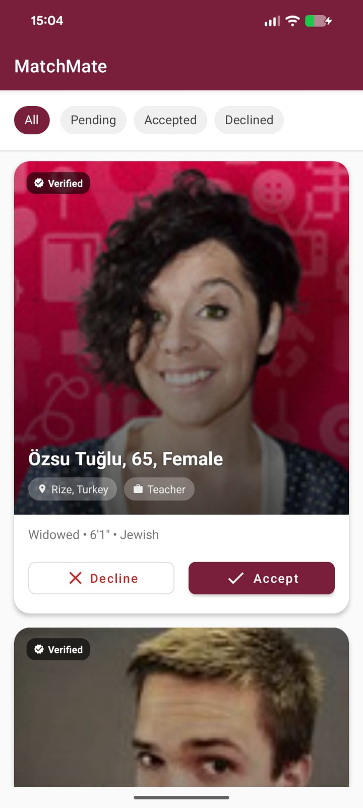
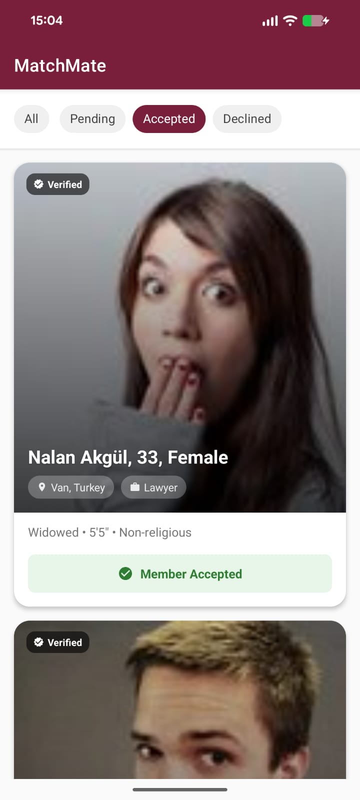
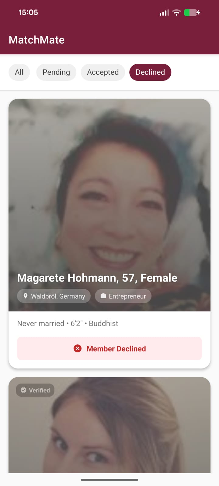

# MatchMate 

MatchMate is an Android application that simulates a matrimonial matchmaking experience. It fetches potential matches from a remote API, displays them as match cards in a scrollable list, and lets users Accept or Decline each profile.

Built with an **offline-first** approach:  cached profiles and prior decisions are always available and actionable without an internet connection.

## 📱 Features
* **Fetch & Display Profiles** — retrieves 10 profiles from the [Random User API](https://randomuser.me/) on first app open, and re-fetches when there's nothing cached to fall back to.
* **Match Cards** — full-bleed photo header with a gradient scrim, name/age/gender, a "Verified" badge, location and profession chips, and a details row (marital status • height • religion).
* **Accept / Decline** — outlined red Decline / filled burgundy Accept buttons on a pending card. Deciding swaps the buttons for a status pill ("Member Accepted" / "Member Declined") and desaturates the photo on decline.
* **Filter Chips** — All / Pending / Accepted / Declined, backed by a Room query per filter so switching chips never touches the network.
* **Loading & Error States** — a spinner while the first fetch is in flight, and a Retry button if it fails with nothing cached; distinguishes "cache is empty" from "cache has data but nothing matches this filter."
* **Offline First** — fully functional without an internet connection: cached profiles, prior decisions, and filtering all keep working.

## 🏗 Architecture & Design Patterns
The project follows **MVVM + Repository**, layered so the UI, business logic, and data sources stay independently testable and swappable.

* **UI Layer** — `MainActivity` and `MatchAdapter` handle rendering only; no persistence or network code lives here. Both use generated **ViewBinding** classes, no `findViewById`.
* **ViewModel Layer** — `MainViewModel` holds UI state (`isLoading`, `hasError`, `filteredUsers`, `filter`) as `LiveData`.
* **Repository Pattern** — `UserRepository` is the sole mediator between `ApiService` (Retrofit) and `UserDao` (Room).
* **Single Source of Truth (SSOT)** — the UI observes Room via `LiveData`. A fetch only ever writes to Room;  so Accept/Decline works offline.

### Package structure
```
com.example.matchmate
│
├── MainActivity.kt      # Single screen: toolbar, filter chips, RecyclerView, state rendering
│
├── data
│   ├── api          # ApiService (Retrofit interface), RetrofitClient
│   ├── local         # AppDatabase, UserDao, UserEntity, MatchStatus, Converters
│   ├── model         # DTOs for the RandomUser API response
│   └── repository    # UserRepository, ProfileDetailsGenerator
│
├── ui
│   ├── main          # MainViewModel, MainViewModelFactory, MatchFilter
│   └── adapter       # MatchAdapter (ListAdapter + DiffUtil)
│
└── utils             # ConnectivityObserver (network-restore detection)
```

## 🛠 Libraries & Tech Stack
* **Kotlin** — 100% Kotlin codebase.
* **Coroutines** — safe, asynchronous, non-blocking operations.
* **Retrofit & Gson** — REST API communication and JSON parsing.
* **Room** — local SQLite persistence and offline caching, with **KSP** (not kapt) generating the DAO implementations.
* **LiveData & ViewModel** — lifecycle-aware state management, single continuous LiveData chain from `UserDao` to the UI.
* **Glide** — remote image loading, with a `ColorMatrixColorFilter` applied for the declined-card grayscale effect.
* **Material Components / View Binding** — modern Android UI, XML layouts with RecyclerView, MaterialCardView, and Chip filters.

## 🚀 Setup & Installation
1. Clone the repository.
2. Open the project in Android Studio.
3. Let Gradle sync dependencies.
4. Build and run on an emulator or physical device (API 24+).

## 🎲 Randomly Generated Fields
The Random User API only returns generic identity data — it has no concept of a matrimonial profile. To make the match cards feel complete, `ProfileDetailsGenerator` fills in the fields the API doesn't provide.

| Field | Source |
|---|---|
| First/last name, age, gender, location, photo, email | **Real** — from the Random User API response |
| Profession | Randomly generated (e.g. Architect, Software Engineer, Physician, Lawyer) |
| Marital status | Randomly generated (Never married / Divorced / Widowed) |
| Religion | Randomly generated (e.g. Catholic, Hindu, Muslim, Buddhist) |
| Height | Randomly generated, 5'0"–6'3" |
| "Verified" badge | Randomly generated (~70% of profiles) |

These fields exist purely to make the UI (profession/location chips, the details row, the verified badge) feel like a real matrimonial profile — they carry no other logic or meaning in the app and are not meant to represent real user data.


## 📱 Screenshots

<p align="center">
  
  
  
</p>